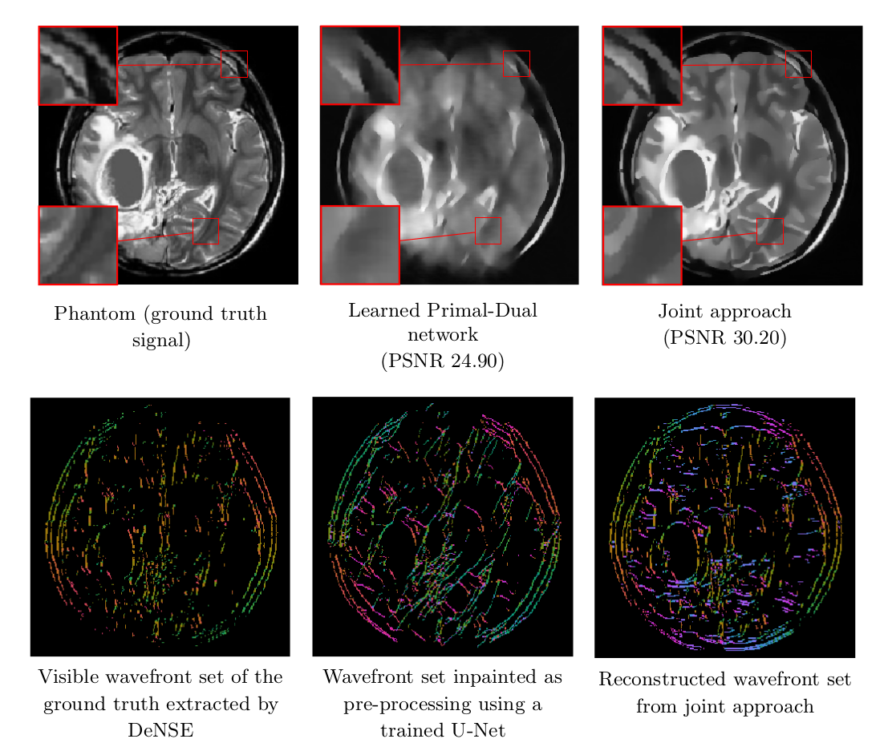

# Deep Microlocal Reconstruction
By H. Andrade-Loarca, G. Kutyniok, O. Öktem, P. Petersen




### License

This code is released under the MIT License (refer to the LICENSE file for details).

### Contents
0. [Introduction](#introduction)
0. [Citation](#citation)
0. [Installation](#installation)
0. [Usage](#usage)
0. [Contact](#contact)

### Introduction

This repository contains the entire pipline (including data preprocessing, training, testing, evaluation and visualization) for **Deep Microlocal Reconstruction for Limited-Angle Tomography**.

The algorithm is based on a recently developed digital wavefront set extractor [DeNSE](https://github.com/arsenal9971/DeNSE) as well as the well-known microlocal canonical relation for the Radon transform. We use the wavefront set information about x-ray data to improve the reconstruction by requiring that the underlying neural networks simultaneously extract the correct ground truth wavefront set and groundtruth image.  As a necessary theoretical step, we identify the digital microlocal canonical relations for deep convolutional residual neural networks.  We find strong numerical evidence for the effectiveness of this approach

### Citation

If you find **Deep Microlocal Reconstruction for Limited-Angle Tomography** useful in your research, please consider to cite the following papers:

	@inproceedings{andrade2021deepmicrorecon, 
	  title={Deep Microlocal Reconstruction for Limited-Angle Tomography}, 
	  author={Andrade-Loarca, Hector, Kutyiniok, Gitta, Öktem, Ozan, Petersen, Philipp},
	  booktitle={arXiv preprint: arXiv:2108.05732 }, 
	  year={2021}
	}


### Installation

You can install all the dependencies by using the conda local enviroment file.  

```
conda env create -f environment.yaml
conda activate deepmicro
```

### Usage

The different experiments presented in the preprint are here organized in different folders. The folder `Joint_CT_WFset_inpaint` contains the experiments corresponding to the joint reconstruction. The folder `Microlocal_NN` contains the code corresponding to the microcanonical relation of the learned primal-dual reconstruction. The folder `Real_phantoms` contains the code necessary to generate the realistic phantoms data set that was used to train the reconstruction model. Finally, the folder `WF_inpaint` contains the experiments corresponding to the wavefront set inpainting. 

### Contact

[Hector Andrade-Loarca](https://arsenal9971.github.io/)

  Questions can also be left as issues in the repository. We will be happy to answer them.
